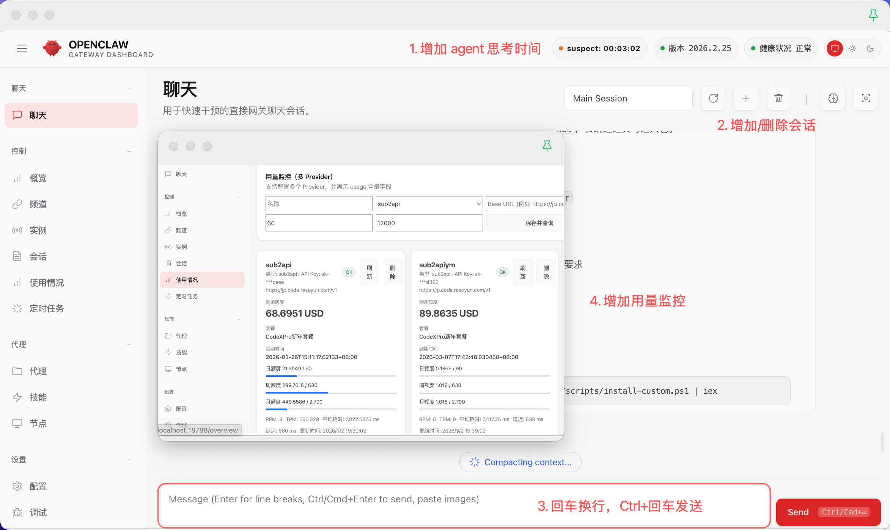
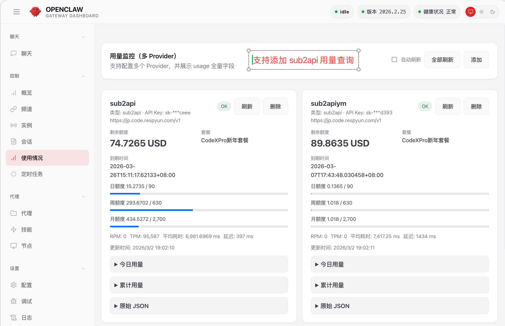

# openclaw-src

## 1. 概述 + 图片

`openclaw-src` 是基于 OpenClaw 的实用增强版，目标是让日常使用更顺手：会话管理更高效、thinking 状态更透明、异常恢复更可靠。




## 2. 核心特性

- 会话管理增强（Control UI）
  - 顶部支持创建（`+`）、删除（trash）、刷新
  - 创建支持完整 key / 短后缀 / 随机后缀
  - 删除支持序号、完整 key、尾部匹配
  - Chat 下拉显示 all sessions（不再 recent-only）
- 每会话 Thinking + Liveness 自愈
  - 持久化 `thinkingStartedAt`、`thinkingRunId`
  - 顶部状态支持 `idle / thinking / suspect / stalled`
  - progress-based liveness 区分长任务与无响应
  - stalled/timeout 自动回收，gateway 重启后自动清理 orphan marker
- 输入体验优化
  - `Enter` 换行，`Ctrl/Cmd+Enter` 发送
  - 移除输入框内 `New session` 按钮
- Usage 页面优化
  - Provider 用量卡片、多 Provider 配置
  - 今日/累计默认折叠，支持原始 JSON 排障
- 移动端可用性修复
  - 聊天控制区可见且可操作
  - 头部与控制区布局更稳定，间距更紧凑

## 3. 一键部署

不需要手动 clone。直接运行：

> 注意：安装脚本会先强制卸载当前 OpenClaw，再重新安装，确保环境干净无版本干扰。

### macOS / Linux（推荐）

```bash
curl -fsSL https://raw.githubusercontent.com/xiaoyu3567/openclaw-src/main/scripts/install-custom.sh | bash
```

### macOS / Linux（完整升级：UI + 后端）

```bash
curl -fsSL https://raw.githubusercontent.com/xiaoyu3567/openclaw-src/main/scripts/install-custom.sh | bash -s -- --scope full
```

### Windows（PowerShell）

```powershell
iwr -useb https://raw.githubusercontent.com/xiaoyu3567/openclaw-src/main/scripts/install-custom.ps1 | iex
```

### Windows（PowerShell，完整升级：UI + 后端）

```powershell
$tmp = Join-Path $env:TEMP "install-custom.ps1"
iwr -useb https://raw.githubusercontent.com/xiaoyu3567/openclaw-src/main/scripts/install-custom.ps1 -OutFile $tmp
powershell -ExecutionPolicy Bypass -File $tmp -Scope full
```

安装脚本会自动完成：

1. 检查基础依赖
2. 强制卸载当前已安装的 OpenClaw（避免版本干扰）
3. 重新安装 OpenClaw
4. 拉取或复用 `~/.openclaw/workspace/openclaw-src`
5. 安装依赖并执行部署助手（推荐模式）
